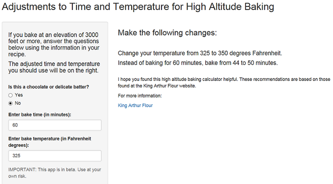

## What it is

The high altitude baking calculator is located at: 
  
<https://margiehertneck.shinyapps.io/HighAltBaking> 

The calculator converts time and temperature in a recipe for more successful baking at high altitude.  

High altitude is considered 3000 feet or more above sea level.  Bakers who live at or above this threshold must make adjustments to their baking recipes because the air is "thinner" and gravity is slighly less.  This calculator makes the adjustments easier. 

--- .class #id 

## How to use the calculator

Simply follow the instructions on the left side of the screen, using your recipe to input the time, temperature and whether your baking product is primarily chocolate or a delicate item, such as those that use meringue for more loft in the batter.



--- .class #id 

## Example

Let's say you want to bake a chocolate cake and the recipe says bake it at 350 degrees Fahrenheit for 35 minutes.  The calculator will return:


```
## [1] "Change your temperature from 350 to 365 degrees Fahrenheit."
```

```
## [1] "Instead of baking for 35 minutes, bake from 26 to 29 minutes."
```


--- .class #id 

## References and additional notes

The information used to create the high altitude baking calculator comes from the King Arthur Flour website at:

<http://www.kingarthurflour.com/recipe/high-altitude-baking.html>

This calculator is in beta and the user assumes all risk for using it.  There are no guarantees on your results.


